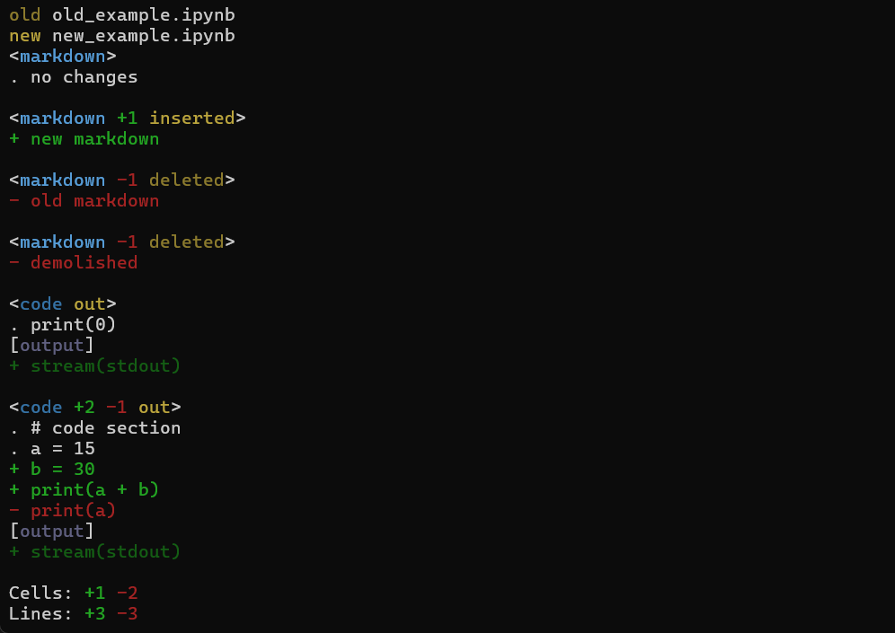
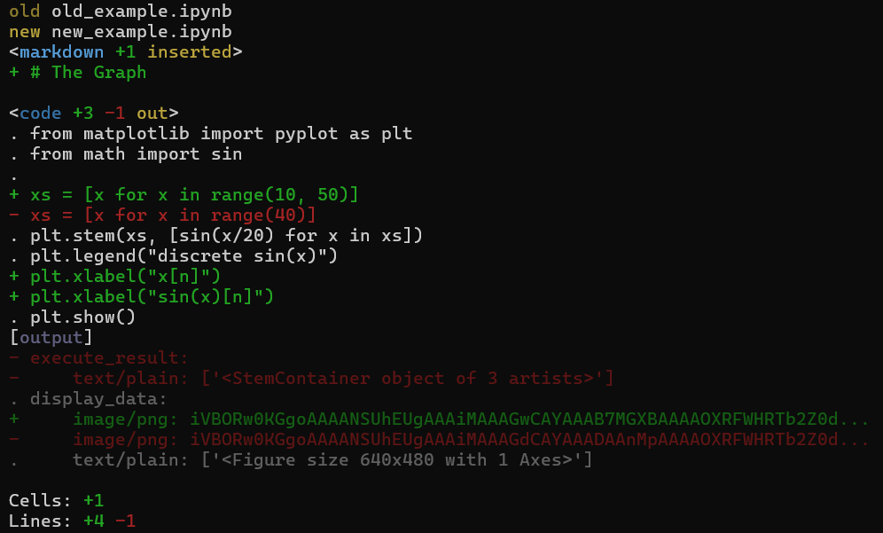

# General

**nbdelta** is a tool to compare two **.ipynb** files.

And there is some features to simplify and customize collaborative work with **git**.

# Commands list

# Usage

You can use nbdelta in 3 ways:

## I. As detached program

## II. As submodule

## III. As python module(coming soon)